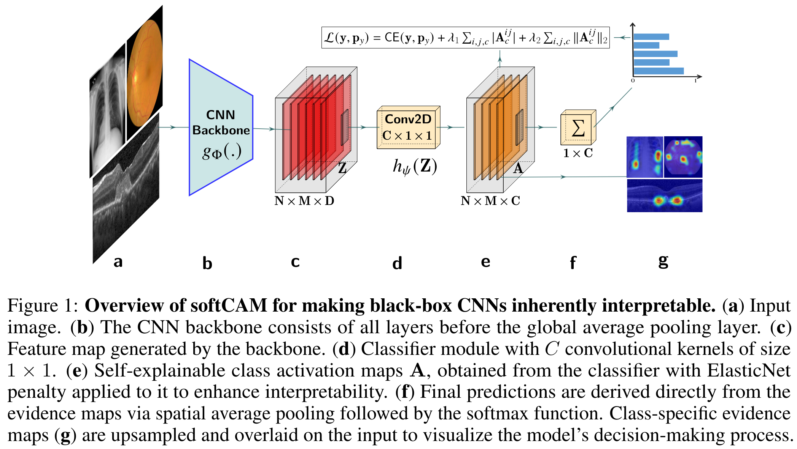

# Soft-CAM: Making black box models self-explainable for high-stakes decisions
This repository contains the official implementation of the Self-Explainable CNN-Transformer architecture from the paper ["Soft-CAM: Making black box models self-explainable for high-stakes decisions"](https://github.com/).

## Model's architecture


## Dependencies
All packages required for running the code in the repository are listed in the file `requirements.txt`

## Data
The code in this repository uses publicly available datasets for the [Diabetic Retinopathy Detection Challenge](https://www.kaggle.com/c/diabetic-retinopathy-detection/data), [Retinal OCT Dataset](https://data.mendeley.com/datasets/rscbjbr9sj/3), and the [RSNA Pneumonia dataset](https://www.rsna.org/rsnai/ai-image-challenge/rsna-pneumonia-detection-challenge-2018).

For each dataset, the CSV files used to train the models are available in `csv_files`


The images used for figures 2, and 4 are provided in `./files/images`

## How to use: Training
### 1. Organize the dataset as follows:
```
├── main_folder
    ├── Kaggle_datset 
      ├── image1.png
      ├── image2.png
      ├── ...
    ├── OCT_dataset
      ├── image1.png
      ├── image2.png── ....
    ├── RSNA_dataset
      ├── image1.png
      ├── image2.png── ....
    ├── Outputs
      ├── ResNet-SoftCAM
      ├── Vgg-SoftCAM 
```

Replace the path `configs/paths.yaml` 

### 2. Update the training configurations and hyperparameters 
Update the training configurations and hyperparameters in: 

 `./configs/default.yaml`

### 3. Run to train
- Create a virtual environment and install dependencies 
```shell
$ pip install requirements.txt
```
- Run a model with previously defined parameters
```shell
$ python main.py
```

### 4. Monitor the training progress 
Monitor the training progress in website [127.0.0.1:6006](127.0.0.1:6006) by running:

```
$ tensorborad --logdir=/path/to/your/log --port=6006
```

## Reproducibility
Models weights and evaluation codes are available upon request

## Acknowledge
- This repository contains modified source code from [interpretable-sparse-activation](https://github.com/kdjoumessi/interpretable-sparse-activation)
- We greatly thanks the reviews of xxx 2025 for improving this work.

## Reference
```
@InProceedings{xxx,
        author = { xxx, xxx, xxx},
        title = {Soft-CAM: Making black box models self-explainable for high-stakes decisions},
        booktitle = {Submitted to xxx},
        year = {2025}
}
```
